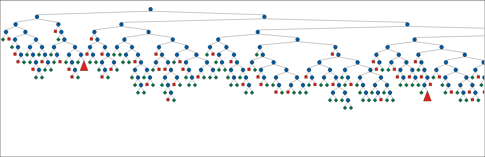
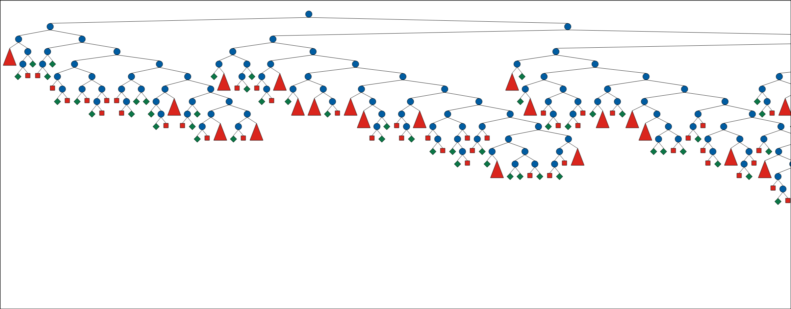
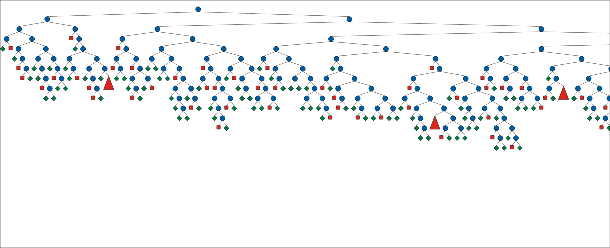
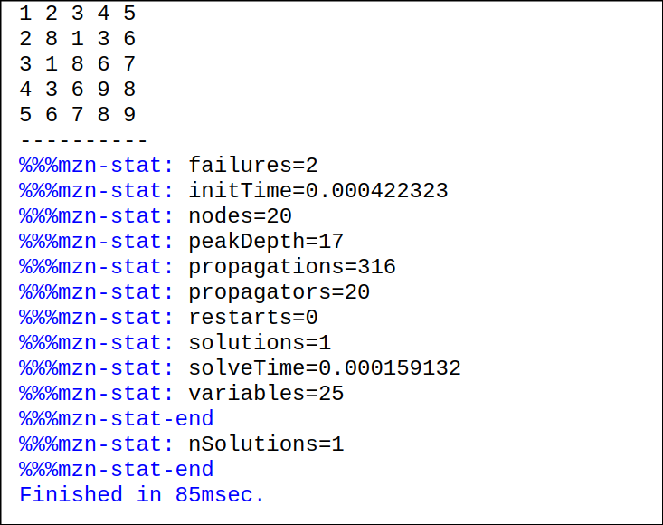
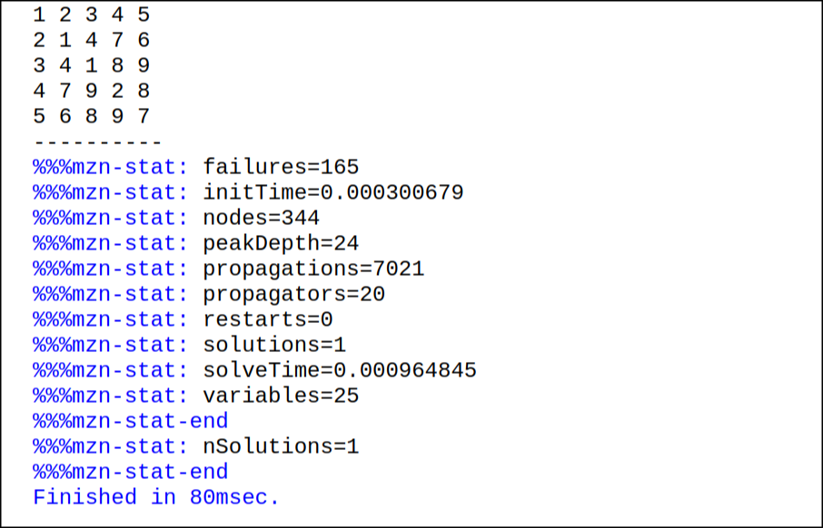
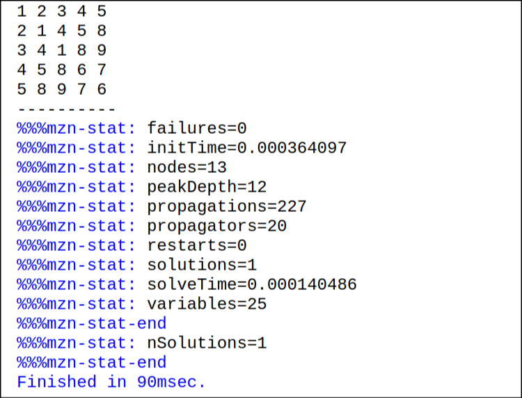

# Modelado del Kakuro como un Problema de Satisfacción de Restricciones (CSP)

**Autor(es):** Juan Manuel Arango Y Alex Garcia Castañeda  
**Fecha:** Marzo 15, 2025  
**Curso:** Programación por Restricciones  
**Profesor:** Carlos Andrés Delgado S.

---

## 1. Introducción

El Kakuro es un rompecabezas lógico derivado del Sudoku, conocido también como "rompecabezas de sumas cruzadas". Consiste en una cuadrícula donde las casillas deben rellenarse con números del 1 al 9, respetando restricciones de suma en filas y columnas definidas por pistas numéricas, sin repetir dígitos en ninguna serie de casillas contiguas (horizontal o vertical). Este informe describe el modelado del Kakuro como un Problema de Satisfacción de Restricciones (CSP), su implementación en MiniZinc, y un análisis comparativo de diferentes estrategias de búsqueda.

---

## 2. Descripción Detallada del Modelo CSP

Un CSP se define por tres componentes principales: variables, dominios y restricciones. A continuación, se detalla el modelado del Kakuro:

### 2.1. Variables

Las variables representan las casillas de la cuadrícula que deben ser rellenadas con números. Sea una cuadrícula de tamaño $n \times n$, donde $n$ es el número de filas y columnas:

- $grid[i, j]$ : Variable que representa el valor en la posición $(i, j)$ de la cuadrícula, donde $i$ y $j$ están en el rango $1..n$ .
- Solo las casillas "blancas" (rellenables) son variables; las casillas "negras" (con pistas) se manejan como parte de las restricciones o datos de entrada.

### 2.2. Dominios

El dominio de cada variable $grid[i, j]$ es el conjunto de valores posibles que puede tomar:

- $DOMAIN = \{1, 2, 3, 4, 5, 6, 7, 8, 9\}$, ya que el Kakuro usa dígitos del 1 al 9.

### 2.3. Restricciones

Las restricciones aseguran que la solución cumpla las reglas del Kakuro:

1. **Unicidad**: En cada serie de casillas contiguas (horizontal o vertical), los valores deben ser distintos. Esto se implementa con la función `alldifferent`.

   - Para una serie horizontal en la fila $i$ desde $j_{1}$ hasta $j_{2}$:  
     $alldifferent([grid[i, j] \ | \ j \in j_1..j_2])$
   - Para una serie vertical en la columna $j$) desde $i_{1}$ hasta $i_{2}$:  
     $alldifferent([grid[i, j] \ | \ i \in i_1..i_2])$

2. **Suma**: La suma de los valores en cada serie debe igualar la pista correspondiente.

   - Para una serie horizontal con suma $row_sum[k]$:  
     $\sum_{j=j_1}^{j_2} grid[i, j] = row_sum[k]$
   - Para una serie vertical con suma $col_sum[k]$:  
     $\sum_{i=i_1}^{i_2} grid[i, j] = col_sum[k]$

3. **Casillas predefinidas**: Algunas casillas pueden tener valores iniciales fijos (pistas parciales), que se especifican en los datos de entrada.

---

## 3. Código MiniZinc Utilizado

A continuación, se presenta el código MiniZinc (`kakuro.mzn`) adaptado para modelar el Kakuro. Este código incluye tres estrategias de búsqueda diferentes.

```minizinc
include "alldifferent.mzn"; % Se incluye la librería para la restricción de valores únicos

int: n; % Tamaño de la cuadrícula
set of int: DOMAIN = 1..9; % Define los valores permitidos en la cuadrícula

array[1..n, 1..n] of var DOMAIN: grid; % Definición de la cuadrícula como un array bidimensional de variables

constraint forall(i in 1..n) (
    alldifferent([grid[i, j] | j in 1..n]) /\ % Garantiza valores únicos en cada fila
    sum([grid[i, j] | j in 1..n]) = row_sum[i] % La suma de la fila debe coincidir con row_sum[i]
);

constraint forall(j in 1..n) (
    alldifferent([grid[i, j] | i in 1..n]) /\ % Garantiza valores únicos en cada columna
    sum([grid[i, j] | i in 1..n]) = col_sum[j] % La suma de la columna debe coincidir con col_sum[j]
);

array[1..n] of int: row_sum; % Sumas esperadas por fila
array[1..n] of int: col_sum; % Sumas esperadas por columna

solve :: int_search(grid, first_fail, complete) satisfy; % Estrategia de búsqueda para resolver el problema
%solve :: int_search(grid, smallest, complete) satisfy; % Opción alternativa de búsqueda (comentada)
%solve :: int_search(grid, input_order, complete) satisfy; % Otra opción de búsqueda (comentada)

output [show(grid[i, j]) ++ if j == n then "\n" else " " endif | i in 1..n, j in 1..n]; % Formato de salida de la cuadrícula
```

---

## 4. Resultados y Estrategias de Distribución en MiniZinc

Para resolver el modelo CSP del Kakuro, se utilizaron diferentes estrategias de distribución en MiniZinc. A continuación, se presentan los resultados obtenidos y un análisis de cada estrategia.

### 4.1. Estrategias de Distribución Evaluadas

En MiniZinc, la distribución de valores en las variables puede influir significativamente en el rendimiento de la resolución del problema. Se probaron las siguientes estrategias:

1. **first_fail**: Selecciona primero la variable con el dominio más pequeño, lo que ayuda a reducir rápidamente el espacio de búsqueda.

   ```minizinc
      solve :: int_search(grid, first_fail, complete) satisfy;
   ```

   

2. **smallest**: Prioriza la asignación de valores a las variables con los valores más pequeños en su dominio.

   ```minizinc
      solve :: int_search(grid, smallest, complete) satisfy;
   ```

   

3. **input_order**: Asigna valores en el orden en que las variables aparecen en el modelo, sin heurísticas avanzadas.

   ```minizinc
      solve :: int_search(grid, input_order, complete) satisfy;
   ```

   

### 4.2 Comparación de resultados

Se ejecutaron pruebas con una cuadrícula de tamaño $5 \times 5$ con diferentes valores de `row_sum` y `col_sum`. Se midió el tiempo de ejecución y la cantidad de iteraciones necesarias para encontrar la solución

| Estrategia    | Tiempo de Ejecución | Iteraciones | Observaciones                                                                         |
| ------------- | ------------------- | ----------- | ------------------------------------------------------------------------------------- |
| `first_fail`  | 0.0002 s            | 23          | Encuentra soluciones rápidamente con pocas iteraciones.                               |
| `smallest`    | 0.0009 s            | 355         | Más iteraciones que `first_fail`, posiblemente debido a su criterio de selección.     |
| `input_order` | 0.00015 s           | 15          | La estrategia más rápida en este caso, pero depende del orden inicial de los valores. |

### 4.3 Evidencias

#### `first_fail`



#### `smallest`



#### `input_order`



## 5. Conclusiones

El modelado del Kakuro como un Problema de Satisfacción de Restricciones (CSP) permitió encontrar soluciones de manera eficiente utilizando MiniZinc. A partir de la implementación y experimentación con diferentes estrategias de búsqueda, se obtuvieron las siguientes conclusiones:

- **Eficiencia de las estrategias:** La estrategia `first_fail` mostró un buen rendimiento al reducir el espacio de búsqueda y encontrar soluciones con pocas iteraciones. Sin embargo, en este caso, `input_order` resultó ser la más rápida, lo que indica que el orden inicial de las variables puede influir significativamente en el tiempo de resolución.

- **Impacto de la heurística `smallest`**: Aunque esta estrategia prioriza las variables con los valores más pequeños, en este caso generó un mayor número de iteraciones, lo que sugiere que su efectividad puede depender de la estructura específica del problema.

- **Flexibilidad del modelo:** MiniZinc permite probar diferentes estrategias de búsqueda y ajustar restricciones según las necesidades del problema, lo que facilita la experimentación con distintos enfoques para optimizar la solución.

- **Aplicabilidad en problemas reales:** Este enfoque puede extenderse a otros problemas combinatorios similares, como el Sudoku y problemas de planificación de recursos, permitiendo un análisis estructurado y eficiente de restricciones.

En general, el uso de técnicas de CSP y MiniZinc proporciona un marco flexible y potente para resolver problemas combinatorios de manera eficiente.
niZinc proporciona una solución estructurada y eficiente para resolver el Kakuro, demostrando la utilidad de los modelos declarativos en la resolución de problemas complejos.
